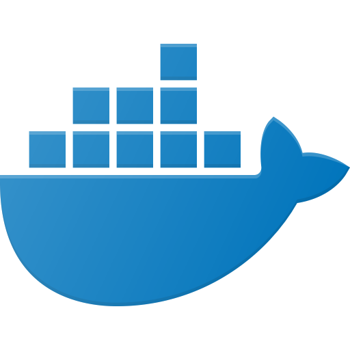
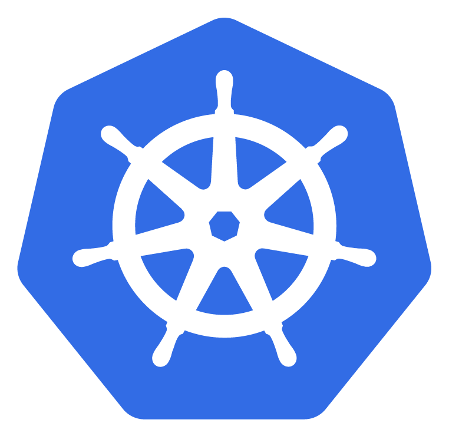
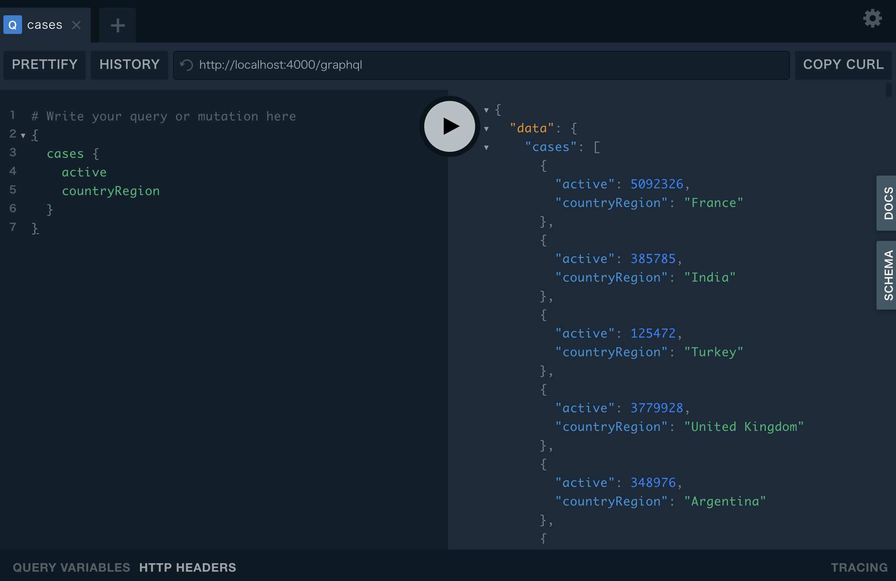
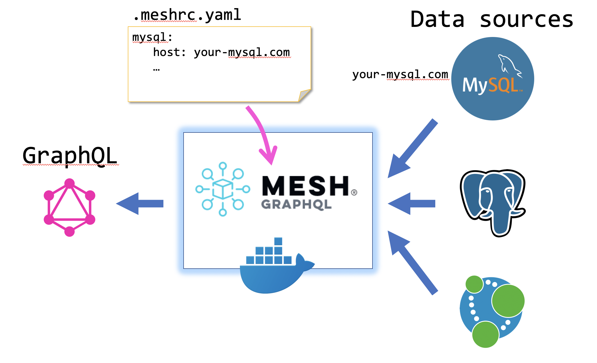
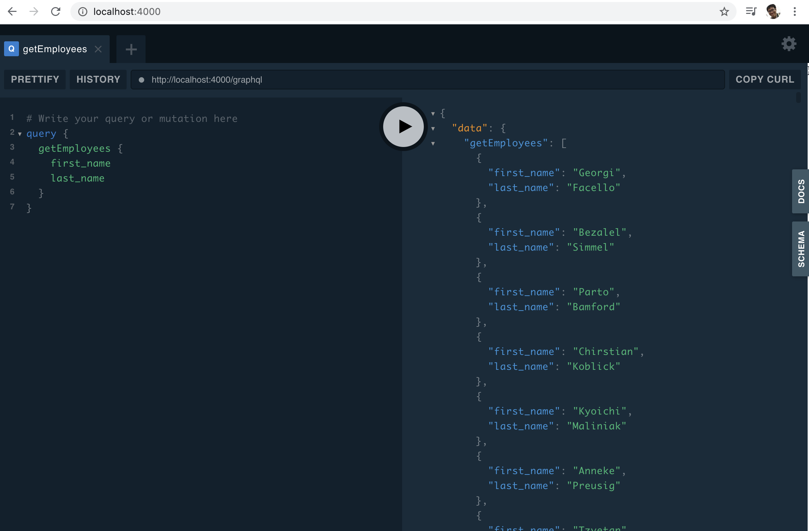

# GraphQL Mesh Docker (supports Kubernetes/Helm)

 on  or   /  

Simple docker image to run just a [GraphQL Mesh](https://github.com/Urigo/graphql-mesh) (Thank you [Urigo](https://github.com/Urigo) and Mesh community for developing nice tool!)

Please prepare only Docker environment or Kubernetes and run the command. No need to understand Node.js.

- [GraphQL Mesh Docker (supports Kubernetes/Helm)](#graphql-mesh-docker-supports-kuberneteshelm)
- [TL;DR](#tldr)
- [Architecture](#architecture)
- [Docker Images for GraphQL Mesh](#docker-images-for-graphql-mesh)
- [Run](#run)
  - [1. On Docker](#1-on-docker)
  - [2. On Kubernetes](#2-on-kubernetes)
      - [2.1 Use `kubectl`](#21-use-kubectl)
      - [2.2 Use `helm`](#22-use-helm)
        - [Parameters](#parameters)
- [Customize](#customize)
  - [Customize .meshrc](#customize-meshrc)
      - [On Docker](#on-docker)
      - [On Kubernetes (not using Helm)](#on-kubernetes-not-using-helm)
      - [With Helm](#with-helm)
  - [Clone another existing example and run in Docker](#clone-another-existing-example-and-run-in-docker)
- [Example](#example)
  - [GraphQL Mesh with MySQL](#graphql-mesh-with-mysql)
- [Build on your own](#build-on-your-own)


# TL;DR

```sh
# Run on Docker
docker run --name mesh -p 4000:4000 -it --volume ${PWD}/docker/work/.meshrc.yaml:/work/.meshrc.yaml --rm hiroyukiosaki/graphql-mesh:latest-all-alpine
# or run with docker-compose
cd docker && docker-compose up -d mesh-all-alpine
# or run on Kubernetes with helm 
helm repo add graphql-mesh https://onelittlenightmusic.github.io/graphql-mesh-docker/helm-chart
helm repo up
helm install my-graphql-mesh graphql-mesh/graphql-mesh
```

And access to `http://localhost:4000`.

Run a query.

```graphql
{
  cases {
    active
    countryRegion
  }
}
```



# Architecture



Data sources are databases like MySQL or PostgreSQL.

[GraphQL Mesh](https://github.com/Urigo/graphql-mesh) can convert these data sources to GraphQL API.

GraphQL Mesh Docker runs GraphQL Mesh in Docker container. You can customize GraphQL Mesh settings by changing `.meshrc.yaml` and mounting the file in Docker container ([see Customize](#customize))

# Docker Images for GraphQL Mesh

- [`graphql-mesh` on Dockerhub](https://hub.docker.com/repository/docker/hiroyukiosaki/graphql-mesh)

| Tag | Description |
|---|---|
| `latest` ([Dockerfile](./docker/Dockerfile)) | Includes minimum CLI and handler ([`@graphql-mesh/openapi`](https://graphql-mesh.com/docs/handlers/openapi)) |
| `latest-alpine` ([Dockerfile](./docker/Dockerfile-alpine)) | Alpine version for minimum footprint which includes minimum CLI and handler ([`@graphql-mesh/openapi`](https://graphql-mesh.com/docs/handlers/openapi)) |
| `latest-all` ([Dockerfile-all](./docker/Dockerfile-all)) | Includes [all handlers](https://graphql-mesh.com/docs/handlers/available-handlers/) |
| `latest-all-alpine` ([Dockerfile-all](./docker/Dockerfile-all-alpine)) | Alpine version for minimum footprint which includes [all handlers](https://graphql-mesh.com/docs/handlers/available-handlers/) |

# Run

You can choose step for your envionment (Docker or Kubernetes)

## 1. On Docker 

Simply run this command.

```sh
# Just docker run (choose tag version)
docker run --name mesh -p 4000:4000 -it --rm hiroyukiosaki/graphql-mesh:latest
docker run --name mesh -p 4000:4000 -it --rm hiroyukiosaki/graphql-mesh:latest-all
```

Alternatives

```sh
# docker-compose
docker-compose up -d mesh
# or to run vX.X.X-all
docker-compose up -d mesh-all
```

After running docker image, you can access to GraphQL Mesh service at `http://localhost:4000` and you will see this screen. 

## 2. On Kubernetes

There are two methods.

- `kubectl`
- `helm`

You need Kubernetes cluster.

If you don't have Kubernetes cluster, you can create Kubernetes on Docker with [KinD](https://github.com/kubernetes-sigs/kind)

```sh
kind create cluster --name graphql --config kind-config.yaml
```

  #### 2.1 Use `kubectl`

  ```sh
  # If you want to change image, please edit k8s/pod.yaml
  kubectl apply -f k8s/basic
  # or
  kubectl apply -f k8s/jsonschema-covid19
  ```

  After the pod running, we can forward the kubernetes service port to local machine with this command and access to GraphQL Mesh at `http://localhost:4000`.

  ```
  kubectl port-forward svc/mesh-svc 4000:4000 &
  ```

  #### 2.2 Use `helm`

  ```sh
  # Add repository
  helm repo add graphql-mesh https://onelittlenightmusic.github.io/graphql-mesh-docker/helm-chart
  # Refresh repository
  helm repo up
  # Install helm chart into Kubernetes
  helm install my-graphql-mesh graphql-mesh/graphql-mesh
  # or install with parameter file
  helm install my-graphql-mesh graphql-mesh/graphql-mesh -f <parameter-values.yaml>
  ```

  ##### Parameters

  | Name | Description | Default |
  |-|-|-|
  | `mountConfigMap.".meshrc.yaml"` | ConfigMap name containing `.meshrc.yaml` file | `None` |
  | `mountConfigMap."example-query.graphql"` | ConfigMap name containing `example-query.graphql` file | `None` |
  | `mountConfigMap."init.sh"` | ConfigMap name containing `init.sh` file. If it exists, container runs GraphQL Mesh after it runs `init.sh` | `None` |
  | `mount.".meshrc.yaml"` | inlined `.meshrc.yaml` file | `None` |
  | `mount."example-query.graphql"` | inlined `example-query.graphql` file | `None` |
  | `mount."init.sh"` | inlined  `init.sh` file. If it exists, container runs GraphQL Mesh after it runs `init.sh` | `None` |
  | `replicaCount` | Count of replica pods | `1` |
  | `image.repository` | Image repository | `hiroyukiosaki/graphql-mesh` |
  | `image.tag` | Image tag | `latest` |
  | `image.pullPolicy` | `imagePullPolicy` | `IfNotPresent`|
  | `imagePullSecrets` | Array of secret name | `[]` |
  | `serviceAccount.create` | Create a ServiceAccount for GraphQL Mesh | `true` |
  | `serviceAccount.name` | ServiceAccount name | `""` |
  | `serviceAccount.annotations` | Annotation structure for ServiceAccount | `{}` |
  | `service.type` | Service type | `ClusterIP` |
  | `service.port` | Service port | `80` |
  | `service.annotations` | Annotation structure for Service | `{}`|
  | `ingress.enabled` | Enable an Ingress | `false` |
  | `ingress.annotations` | Annotation structure for Ingress | `{}` |
  | `ingress.hosts.host` | Host name for Ingress | `graphql-mesh.127.0.0.1.xip.io` |
  | `ingress.hosts.path` | Host path array for Ingress | `[]` |
  | `resources` | Resource limits and requests (e.g. `limits: { cpu: 100m, memory: 128Mi }`) | `{}` |

  > Please refer to [sample parameter values file](helm-chart/sample-values.yaml) for details.

# Customize

There are two ways to customize GraphQL Mesh Docker.

- Customize `.meshrc.yaml`
- Clone an existing example and run in Docker

## Customize .meshrc

> [GraphQL Mesh Basic Usage (official document)](https://graphql-mesh.com/docs/getting-started/basic-example/)

- Create your `.meshrc.yaml`. Please follow the guidance of the official document above.
- Place `.meshrc.yaml` in the current directory.

  #### On Docker

  - Go to `docker` directory.
  - Edit `docker-compose.yaml` file in order to point your `.meshrc.yaml` and mount it to `/work/.meshrc.yaml`

  ```yaml
      volumes:
        - ./.meshrc.yaml:/work/.meshrc.yaml # <- comment out and point to your .meshrc.yaml
  ```
  - Run `docker-compose up -d mesh`

  #### On Kubernetes (not using Helm)
  - **Overwrite** new ConfigMap resource file with this command.

  ```sh
  kubectl create cm meshrc-cm --from-file .meshrc.yaml --dry-run -o yaml> k8s/basic/meshrc-cm.yaml
  ```
  - Run `kubectl apply -f k8s/basic`

  #### With Helm

  Download [sample values.yaml file](helm-chart/sample-values.yaml) and edit it to include your `.meshrc.yaml` 

  ```yaml
  mount:
  .meshrc.yaml: |-
    sources:
      - name: Ghibli
        handler:
          openapi:
            source: https://ghibliapi.herokuapp.com/swagger.yaml
  ```

## Clone another existing example and run in Docker

```sh
# This clones example and creates a directory "covid-mesh"
git clone https://github.com/jycouet/covid-mesh

# Mount this directory into container and run.
docker run --name mesh -p 4000:4000 -v `pwd`/covid-mesh:/work -it --rm hiroyukiosaki/graphql-mesh:v0.1.17 /bin/bash -c 'yarn install && yarn start'
```

# Example

## GraphQL Mesh with MySQL



The following  use [mysql-employee](https://github.com/Urigo/graphql-mesh/tree/master/examples/mysql-employees) example.

Simpler docker-compose setup is [here](https://github.com/onelittlenightmusic/graphql-mesh-docker-mysql-example).

```sh
git clone https://github.com/datacharmer/test_db.git

# Run MySQL and restore employee db
docker run --name mysql -v `pwd`/test_db/:/test_db -e MYSQL_ROOT_PASSWORD=passwd -d -p 3306:3306 mysql --default-authentication-plugin=mysql_native_password
docker exec -it mysql /bin/bash
$ cd /test_db
$ mysql < employees.sql -p
# enter "passwd"

# This clones example
git clone https://github.com/Urigo/graphql-mesh.git

# Mount this directory into container and run.
docker run --name mesh -v `pwd`/graphql-mesh/examples/mysql-employees:/work -p 4000:4000 -d hiroyukiosaki/graphql-mesh:v0.1.17 /bin/bash -c 'sleep 3600'

# Edit .meshrc.yaml
# Point host address like this (in Mac)
#         host: host.docker.internal 

docker exec -it mesh /bin/bash
$ yarn install
$ yarn start
```

Access `http://localhost:4000`


<!---
### GraphQL Mesh with PostreSQL

**[] This example is not fully working.**

This commands use [postgres-geodb](https://github.com/Urigo/graphql-mesh/tree/master/examples/postgres-geodb) example.

```sh
curl -LO https://raw.githubusercontent.com/morenoh149/postgresDBSamples/master/worldDB-1.0/world.sql
docker run --name pg-docker -v `pwd`/world.sql:/world.sql -e POSTGRES_PASSWORD=docker -d -p 5432:5432 postgres
docker exec pg-docker psql -h localhost -d postgres -U postgres -f /world.sql

# This clones example
git clone https://github.com/Urigo/graphql-mesh.git

# Mount this directory into container and run.
[TBD]
```
--->

# Build on your own

Modify Dockerfile and utilize `docker-compose` command to build with Dockerfile.

```sh
docker-compose build
```

